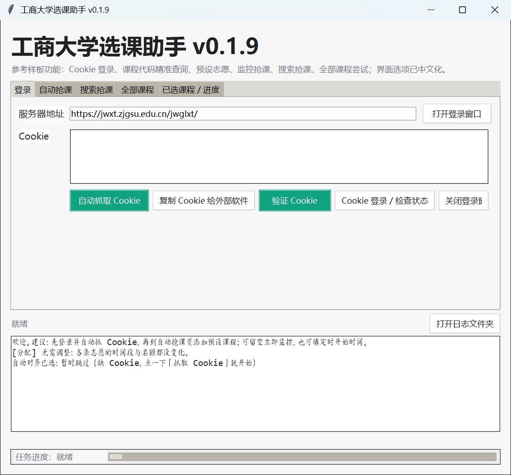
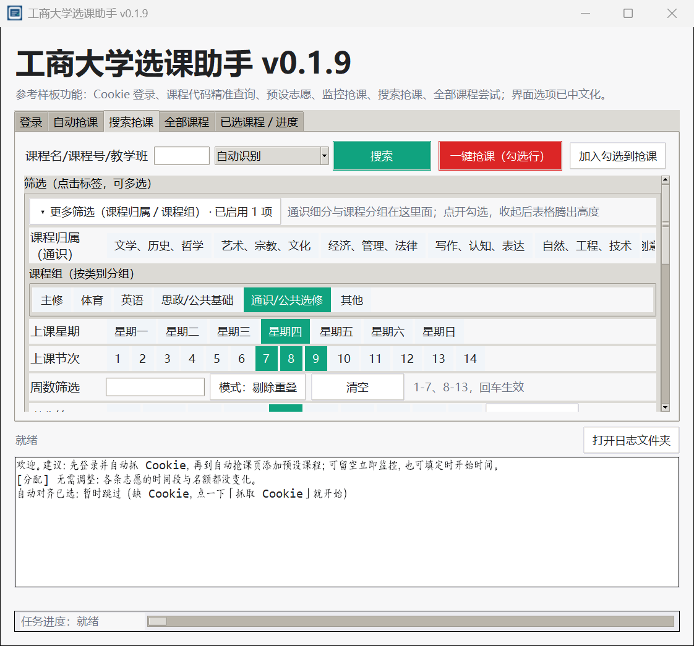

# 工商大学选课助手 (ZJGSU Course Helper)

> 浙江工商大学正方教务系统（`jwxt.zjgsu.edu.cn`）的桌面选课 / 抢课助手。
> Python + Tkinter 单窗口程序，Windows 便携运行，不装浏览器插件、不改系统设置。

[](LICENSE)
[](https://www.python.org/)
[]()
[](docs/CHANGELOG.md)

> ⚠️ **非官方工具**：本项目由学生个人开发，与浙江工商大学教务处、教务处系统维护方无关。
> 仅供学习研究与个人便利使用，请自行遵守学校相关规定，使用风险自负。
> 抢课行为可能受学校规定约束，请在使用前确认合规性。

---

## 界面预览

| 登录 / Cookie | 搜索抢课 |
|---|---|
|  |  |

> 截图取自 v0.1.9 实际运行界面（课程数据为空，不含任何个人信息）。
> v0.1.10 起换了全新图标（见 `docs/CHANGELOG.md`），界面本身未变。

---

## 它能做什么

| 模块 | 能力 |
|---|---|
| **登录 / Cookie** | 打开一个**独立**的 Edge 调试窗口（不碰你日常在用的浏览器），登录后通过 CDP 自动抓取教务 Cookie；可验证 Cookie、一键复制给外部软件 |
| **全部课程** | 8 线程并发拉取全校教学班（实测约 2700 门 / 13 秒），落到本地缓存，离线搜索不再联网 |
| **搜索抢课** | 按课程名 / 课程号 / 教学班搜索；支持**上课节次、周数、学分、校区、课程归属、课程组**多维筛选；勾选多行（全选 / 反选 / 清空 / Ctrl+A）后批量加入志愿、批量一键抢课 |
| **待选课程（志愿）** | 上移 / 下移排序、删除、刷新人数、锁定具体教学班、导出 Excel；每条志愿带课程名 / 教学班 / 时间 / 教室 / 教师 / 余量详情 |
| **自动分配时间段** | 按「已选课表 + 各类别剩余名额」自动挑教学班：避开时间冲突、同一时段不重复押注、优先有空位的班；名额已满的类别只作保底 |
| **循环监控抢课** | 满课盲打（可调节流间隔）、优先盯前 N 门、抢到即记账并从待选移除、**没得抢时自动收工**不在空转；同一门课只押一个班（避免教务把先选上的替换掉） |
| **已选课程 / 进度** | 每 60 秒与教务「真相」对账（教务已选 + 本程序抢到 的并集），实时显示英语 / 体育 / 通识名额进度；掉课自动放回待选 |
| **日志与留痕** | 所有操作、每一轮抢课、教务原始返回都写本地日志，事后可回放「当时为什么没抢到」 |

## 安装与部署

**环境要求**（完整版见 [`docs/DEPLOY.md`](docs/DEPLOY.md)）

| 项目 | 要求 |
|---|---|
| 操作系统 | Windows 10 / 11 (x64)（依赖 Edge 抓 Cookie 与 Windows DPI API） |
| Python | **3.10+**，带 `tkinter`（官方安装包勾选 `tcl/tk` 与 `Add python.exe to PATH`） |
| 依赖包 | 4 个，见 `requirements.txt`（requests / beautifulsoup4 / openpyxl / websocket-client） |
| 浏览器 | Microsoft Edge（Windows 自带）——用于独立登录窗口抓 Cookie |
| 网络 | 能访问 `https://jwxt.zjgsu.edu.cn/`；不需要任何 API Key |
| 权限 | 普通用户即可，不需要管理员；不写注册表、不改系统代理 |

**源码运行（推荐）**

```bash
git clone https://github.com/northartist/zjgsu-course-helper.git
cd zjgsu-course-helper
python -m venv .venv && .venv\Scripts\activate     # 可选但推荐
pip install -r requirements.txt
python zjgsu_launcher.py
```

日常使用直接双击 **`启动工商大学选课助手.vbs`**（无控制台窗口；解释器查找顺序与
`ZJGSU_PYTHONW` 环境变量用法见 [`docs/DEPLOY.md`](docs/DEPLOY.md)）。

**其他部署方式**：便携拷目录运行、PyInstaller 打包成 exe（免装 Python，但目标机仍需 Edge）
—— 步骤、注意事项与部署问题排查表都在 [`docs/DEPLOY.md`](docs/DEPLOY.md)。

**文件落点**（不会污染本目录）：

| 内容 | 路径 |
|---|---|
| 设置、课程缓存、日志、独立 Edge 配置 | `%LOCALAPPDATA%\工商大学选课助手\` |
| Excel 导出 | 点「导出 Excel」后由你在系统对话框里选位置 |

## 快速上手

1. **登录** Tab → 「打开登录窗口」→ 在弹出的独立 Edge 里登录教务 → 「自动抓取 Cookie」→ 「验证 Cookie」
2. **全部课程** Tab → 「拉取全部课程」（首次约 13 秒，之后直接读本地缓存）
3. **搜索抢课** Tab → 设条件搜索 → 勾选目标课 → 「加入勾选到抢课」（想锁定某个教学班就切成教学班模式）
4. **自动抢课** Tab → 「自动分配时间段（按已选课表）」→ 按需调「优先盯前 N 门」「满课节流(秒)」→ 「开始监控」
5. **已选课程 / 进度** Tab → 看名额进度；开启「自动对齐已选（每60秒）」保持与教务同步

> 详细按钮说明、每种筛选条件的语义、日志怎么看，见 [`docs/USAGE.md`](docs/USAGE.md)。
> 环境准备、便携部署、打包成 exe、部署报错排查，见 [`docs/DEPLOY.md`](docs/DEPLOY.md)。
> 想改代码 / 提 PR，先看 [`CONTRIBUTING.md`](CONTRIBUTING.md)（含代码约定与提交口径注意事项）。
> 每次重启软件都要重新点一次「抓取 Cookie」（教务 Cookie 不落盘）。

## 项目结构

```
zjgsu-course-helper/
├── zjgsu_launcher.py            # 主程序：Tkinter GUI + 抢课循环 + 线程池调度（约 3800 行）
├── zjgsu_api.py                 # 教务接口层：Cookie 抓取(CDP) + init/fetch/select 全链路
├── course_state.py              # 状态与规则：去重(核心教学班号)、课表时段、进度统计
├── course_preset_details.json   # 教学班详情缓存（课程名/时间/教室/教师/学分…）
├── backfill_catalog.py          # 一次性维护脚本：从历史 xlsx 回填课程缓存字段
├── zjgsu_launcher.ico           # 程序图标
├── 启动工商大学选课助手.vbs      # 无控制台启动器
├── requirements.txt
├── LICENSE                      # AGPL-3.0
├── THIRD-PARTY.md               # 第三方开源组件与协议标注
├── CONTRIBUTING.md              # 贡献指南（报告 bug 前先看这个）
├── .github/ISSUE_TEMPLATE/      # Issue 模板（Bug 报告 / 功能建议）
└── docs/
    ├── DEPLOY.md                # 部署与环境说明（环境要求 / 三种部署方式 / 排查表）
    ├── USAGE.md                 # 使用手册（每个按钮、每种筛选条件的语义）
    ├── TECH.md                  # 技术架构与接口说明
    ├── CHANGELOG.md             # 版本更新记录
    └── images/                  # 界面截图（README 引用）
```

## 工作原理（简述）

1. **Cookie**：启动一个**独立用户目录**的 Edge 实例并开 `--remote-debugging-port`，程序从 `http://127.0.0.1:<port>/json` 找到教务标签页，用 WebSocket 调 CDP 的 `Network.getCookies` 取回 Cookie —— 你自己的浏览器会话完全不受影响。
2. **接口**：拿到 Cookie 后直接以 `requests.Session` 复刻正方选课链路（`init` → 查询教学班 `cxJxbWithKchZzxkYzb` → 提交志愿 `xkBcZyZzxkYzb` → 已选查询 `cxZzxkYzbChoosedDisplay`），不依赖页面自动化，速度快且可控。
3. **提交策略**：提交是**串行**的（正方选课是会话绑定的写操作，并发会撞「频率过高」且判不准结果归属）；只有只读查询走线程池。
4. **去重与对账**：教学班名可能带三类前缀（校区 / 网课平台 / 课程别名），所以「是不是同一个班」按**核心教学班号**（学期+课程号+班号）比较；已选状态以「教务已选 ∪ 本程序抢到」为准，掉课自动回退。

细节（接口路径、参数、字段、状态机、坑）见 [`docs/TECH.md`](docs/TECH.md)。

## 免责声明

- 本项目**非官方**，作者与浙江工商大学无隶属关系，不代表学校任何立场。
- 教务接口随时可能变更，程序可能失效；作者不保证可用性。
- 请遵守学校教务管理规定，**不要**用于任何影响他人选课公平性的行为（如高频请求、恶意占位）。
- 使用本程序造成的一切后果（包括但不限于选课异常、账号风险、成绩影响）由使用者自行承担。

## 协议与署名

本项目以 **GNU Affero General Public License v3.0 (AGPL-3.0)** 开源，全文见 [`LICENSE`](LICENSE)。
第三方开源组件、接口参考来源与协议见 [`THIRD-PARTY.md`](THIRD-PARTY.md)。

```
Copyright (C) 2026 北面艺术家 (North Artist / @northartist)
```

## 联系作者

| | |
|---|---|
| 邮箱 | **nnorthartist@gmail.com** |
| GitHub | [@northartist](https://github.com/northartist) |
| 问题反馈 | 优先用 [Issues](https://github.com/northartist/zjgsu-course-helper/issues)（贴日志前请先脱敏，见 [`CONTRIBUTING.md`](CONTRIBUTING.md)） |

如果这个工具帮到了你，欢迎在 Issues 里反馈 bug 或提 PR（贡献指南见 [`CONTRIBUTING.md`](CONTRIBUTING.md)）。
